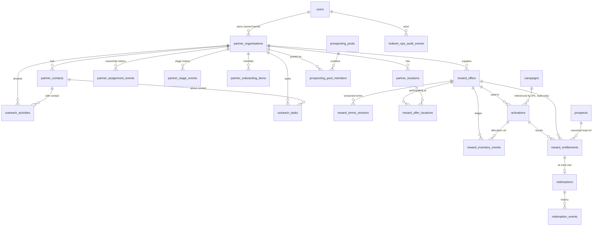

# Redeem Ops — ERD & Schema Design

> Phase 0 deliverable. All tables are NEW except two additive columns on `users`. Conventions
> follow the repo (see `REPOSITORY_DISCOVERY.md` §6): UUID v4 PKs, snake_case plural table names,
> Sequelize-default camelCase columns + `createdAt`/`updatedAt`, explicit associations in
> `models/index.js`, `STRING(n)` + app-level constant lists instead of `DataTypes.ENUM` for
> evolving states (house drift, e.g. `Prospect.dncStatus`). Migrations begin at **045**.

## 1. Entity-relationship diagram

`campaigns`, `prospects`, `users` are the existing MKTR tables — referenced, never redefined.

## 2. Changes to existing tables (migration 045)

`users` (additive only):
- `role` enum: `ALTER TYPE "enum_users_role" ADD VALUE IF NOT EXISTS 'redeem_ops'`
  (idempotent, PG 12+; precedent: migration 029. The custom runner does **not** wrap migrations in
  a transaction — `runMigrations.js:52-63` — so no transaction caveats apply; 029's comment saying
  otherwise is wrong). The enum value is unusable until every code-side touchpoint lands in the
  same change: `User.js:47` role ENUM list, `userService.inviteUser` `allowedRoles`
  (`backend/src/services/userService.js:146` — currently `agent|fleet_owner|driver_partner` only),
  `invitationService` roleLabel (`invitationService.js:63`), the Joi user/invite schemas
  (`middleware/validation.js`), and `getDefaultRouteForRole` (`src/lib/utils.js:8`).
- `redeemOpsRole` STRING(32) NULL — sub-role: `super_admin|ops_admin|bdm|outreach_exec|campaign_ops|redemption_ops|analyst`.

## 3. Tables

### 3.1 `partner_organisations` (model `PartnerOrganisation`)

| Column | Type | Notes |
|---|---|---|
| id | UUID PK | |
| legalName / tradingName / brandName | STRING(160) / STRING(160) / STRING(120) | display values; at least one required |
| normalizedName | STRING(160) NOT NULL | matching key (see §5 normalization) |
| uen | STRING(16) NULL | uppercased; **unique partial index** WHERE uen IS NOT NULL |
| website | STRING(255) NULL | as entered |
| websiteDomain | STRING(160) NULL | normalized eTLD+1-ish key; indexed |
| primaryPhone | STRING(20) NULL | E.164 (+65…) — same validation shape as `Prospect.phone`; **unique partial index** |
| primaryEmail | STRING(160) NULL | lowercased for match |
| instagramHandle / tiktokHandle | STRING(64) NULL | normalized (no @, lowercase); unique partial per column |
| facebookUrl / linkedinUrl | STRING(255) NULL | plus `facebookHandle` STRING(120) normalized, indexed |
| category / subcategory | STRING(64) / STRING(64) | e.g. Pet Grooming / Cat Grooming |
| source | STRING(64) | manual, import batch ref, pool, referral |
| tags | JSONB default [] | |
| notes | TEXT | |
| pipelineStage | STRING(32) NOT NULL default 'UNCLAIMED' | see §6 stage list |
| availability | STRING(24) NOT NULL default 'available' | `available|owned|follow_up_later|restricted|disqualified` (claim gate) |
| ownerUserId | UUID NULL FK→users **SET NULL** | current owner; NULL = unowned |
| claimedAt | DATE NULL | |
| firstOutreachAt | DATE NULL | stamped by first qualifying activity |
| lastActivityAt | DATE NULL | denormalized for queue/stale queries |
| nextTaskAt | DATE NULL | denormalized from open tasks |
| atRiskFlag / staleFlag | BOOLEAN default false | set by sweep, cleared by activity |
| mergedIntoId | UUID NULL self-FK | set when merged; row retained, hidden from lists |
| archivedAt | DATE NULL | soft archive |
| createdBy | UUID FK→users **RESTRICT** | |

Indexes: `(ownerUserId, pipelineStage)`, `(pipelineStage)`, `(availability)`, `(category)`,
`(lastActivityAt)`, `(nextTaskAt)`, `(normalizedName)`, `(websiteDomain)`, uniques above.
These cover the claim/queue/stale hot paths from day one; further list-view composites (e.g.
stage+category+lastActivity combinations, archived/merged partial filters) are **deliberately
deferred to Phase 2**, finalized with EXPLAIN against the real filter combinations on seeded data —
the brief (§36) forbids speculative indexes, so the plan is measure-then-index, not guess.
If `pg_trgm` is available (attempted `CREATE EXTENSION IF NOT EXISTS` inside a try/catch in the
migration — the custom runner permits it), add `GIN (normalizedName gin_trgm_ops)`; otherwise
fuzzy matching falls back to prefix + postal heuristics (§5).

### 3.2 `partner_locations` (`PartnerLocation`)

id; partnerOrganisationId FK **CASCADE**; name STRING(120); addressLine STRING(255);
postalCode STRING(6) (indexed); postalDistrict STRING(2) (derived from first 2 digits — SG district
matching); area STRING(64); phone STRING(20) E.164 NULL; isActive BOOLEAN default true; notes TEXT.
Index: `(partnerOrganisationId)`, `(postalCode)`.

### 3.3 `partner_contacts` (`PartnerContact`)

id; partnerOrganisationId FK **CASCADE**; name STRING(120) NOT NULL; roleTitle STRING(80);
mobile STRING(20) E.164 NULL (indexed partial); whatsapp STRING(20) NULL; email STRING(160) NULL
(lowercased, indexed partial); preferredChannel STRING(24) (`call|whatsapp|email|instagram|other`);
isPrimary BOOLEAN default false; notes TEXT; archivedAt DATE NULL.

### 3.4 `partner_assignment_events` (`PartnerAssignmentEvent`) — append-only

id; partnerOrganisationId FK **CASCADE**; kind STRING(24)
(`claim|assign|reassign|release|restrict|disqualify|merge`); fromUserId / toUserId UUID NULL FK→users
SET NULL; actorUserId UUID NULL FK SET NULL; reason STRING(255); createdAt.
Index `(partnerOrganisationId, createdAt)`.

### 3.5 `partner_stage_events` (`PartnerStageEvent`) — append-only

id; partnerOrganisationId FK **CASCADE**; fromStage/toStage STRING(32); actorUserId FK SET NULL;
reason STRING(255) NULL; createdAt. Index `(partnerOrganisationId, createdAt)`.

### 3.6 `outreach_activities` (`OutreachActivity`)

id; partnerOrganisationId FK **CASCADE**; contactId UUID NULL FK→partner_contacts **SET NULL**;
type STRING(32) (`call_attempt|call_connected|whatsapp_sent|whatsapp_reply|email_sent|email_reply|
instagram_dm|facebook_message|meeting_booked|meeting_completed|proposal_sent|follow_up|
internal_note|other`); direction STRING(12) (`outbound|inbound|internal`); summary STRING(255)
NOT NULL; details TEXT; outcome STRING(64) NULL; occurredAt DATE NOT NULL default now;
actorUserId FK→users SET NULL; editedAt DATE NULL + editedBy UUID NULL (corrections audited, row
updated in place — original captured in audit `before`); voidedAt DATE NULL + voidReason (no
destructive delete). "Meaningful" activity types (everything except `internal_note`) bump
`partner_organisations.lastActivityAt` and stamp `firstOutreachAt` if null.
Indexes: `(partnerOrganisationId, occurredAt DESC)`, `(actorUserId, occurredAt)`.

### 3.7 `outreach_tasks` (`OutreachTask`)

id; title STRING(160) NOT NULL; partnerOrganisationId FK **CASCADE**; contactId NULL FK SET NULL;
assigneeUserId FK→users NOT NULL; createdBy FK→users; dueAt DATE NOT NULL; hasTime BOOLEAN default
false (renders date-only vs timed); priority STRING(12) default 'medium'; type STRING(24)
(`follow_up|call|meeting|proposal|admin|other`); status STRING(16) default 'open'
(`open|in_progress|completed|cancelled`); description TEXT; completedAt DATE; completedBy UUID.
Completing/cancelling recomputes the partner's `nextTaskAt`.
Indexes: `(assigneeUserId, status, dueAt)`, `(partnerOrganisationId, status)`, `(dueAt)` partial
WHERE status IN ('open','in_progress').

### 3.8 `prospecting_pools` (`ProspectingPool`)

id; name STRING(120) unique; description TEXT; category STRING(64) NULL; area STRING(64) NULL;
isActive BOOLEAN default true; createdBy FK→users.

### 3.9 `prospecting_pool_members` (`ProspectingPoolMember`)

id; poolId FK **CASCADE**; partnerOrganisationId FK **CASCADE**; status STRING(16) default
'available' (`available|claimed|removed|exhausted`); addedBy FK; claimedBy UUID NULL; claimedAt.
**Unique (poolId, partnerOrganisationId).** Index `(poolId, status)`.

### 3.10 `partner_onboarding_items` (`PartnerOnboardingItem`)

id; partnerOrganisationId FK **CASCADE**; itemKey STRING(48) (template key, §22 checklist);
label STRING(160); sortOrder INT; status STRING(16) default 'pending' (`pending|in_progress|done|na`);
assigneeUserId NULL FK; completedAt; notes TEXT. Unique `(partnerOrganisationId, itemKey)`.

### 3.11 `reward_offers` (`RewardOffer`)

| Column | Type | Notes |
|---|---|---|
| id | UUID PK | |
| partnerOrganisationId | FK **RESTRICT** | a partner with offers can't be hard-deleted |
| title / publicTitle / internalRef | STRING(160)/(160)/(64) | |
| description | TEXT | |
| category | STRING(64) | |
| rewardType | STRING(24) | `free_service|free_product|free_trial|voucher|credit|discount|experience|other` |
| retailValue | DECIMAL(10,2) NULL | public value |
| fulfilmentCost | DECIMAL(10,2) NULL | if known |
| currency | STRING(3) default 'SGD' | |
| fundingSource | STRING(24) default 'partner' | `partner|mktr|shared` |
| committedQuantity | INT NOT NULL default 0 | total supply committed |
| allocatedQuantity / issuedQuantity / redeemedQuantity | INT NOT NULL default 0 | **guarded counters** (§4) — ledger is the audit truth |
| validityStart / validityEnd | DATE NULL | |
| claimExpiryDays / redemptionExpiryDays | INT NULL | drive entitlement `expiresAt` |
| fulfilmentMethod | STRING(24) | `unique_code|qr|partner_verification|manual_booking|external_link|physical_voucher` |
| externalBookingUrl | STRING(255) NULL | |
| status | STRING(16) default 'draft' | `draft|active|paused|ended` |
| currentTermsVersion | INT default 0 | |
| createdBy | FK→users | |

Index `(partnerOrganisationId, status)`.

### 3.12 `reward_terms_versions` (`RewardTermsVersion`) — append-only

id; rewardOfferId FK **CASCADE**; version INT; structured JSONB (e.g. `{firstTimeOnly, minAge,
appointmentRequired, validDays[], locationsLimited}` — deliberately open; not boolean-per-condition);
freeText TEXT; createdBy; createdAt. **Unique (rewardOfferId, version).**

### 3.13 `reward_offer_locations` — join

id; rewardOfferId FK **CASCADE**; partnerLocationId FK **CASCADE**; unique pair.

### 3.14 `reward_inventory_events` (`RewardInventoryEvent`) — append-only ledger

id; rewardOfferId FK **RESTRICT**; activationId UUID NULL FK SET NULL; entitlementId UUID NULL;
redemptionId UUID NULL; type STRING(24)
(`committed|increased|decreased|allocated|deallocated|issued|issue_reversed|redeemed|expired|
cancelled|manual_adjustment`); quantity INT NOT NULL CHECK (quantity > 0) — direction is carried
by `type`, keeping rows self-describing; actorType STRING(16) default 'staff'
(`staff|partner_user|consumer|system`); actorUserId UUID NULL; reason STRING(255) NULL.
Indexes: `(rewardOfferId, createdAt)`, `(activationId)`.

### 3.15 `activations` (`Activation`)

| Column | Type | Notes |
|---|---|---|
| id | UUID PK | |
| partnerOrganisationId | FK **RESTRICT** | |
| rewardOfferId | FK **RESTRICT** | |
| campaignId | UUID NULL FK→**campaigns** **SET NULL** | canonical MKTR reference; the only cross-module FK besides prospectId/users |
| campaignNameSnapshot | STRING(160) NULL | display survives campaign deletion (Payment-snapshot precedent) |
| allocatedQuantity | INT NOT NULL default 0 | ≤ offer remaining at allocation time (§4) |
| issuedCount / redeemedCount | INT NOT NULL default 0 | guarded counters, ledger-audited |
| status | STRING(16) default 'draft' | `draft|preparing|active|paused|completed|cancelled` |
| startDate / endDate | DATE NULL | |
| internalNotes | TEXT | |
| unlockPolicy | STRING(16) default 'agent_unlock' | `on_capture` (voucher live at signup) \| `agent_unlock` (signup creates a locked reservation; the lead's consultant unlocks it at the physical meeting — the default for review-gated funnels) |
| createdBy | FK→users | |

Indexes: `(partnerOrganisationId)`, `(rewardOfferId)`, `(status)`; **unique partial**
`(campaignId) WHERE status IN ('preparing','active','paused')` — one live activation per campaign,
which makes Phase 6 entitlement issuance deterministic.

Explicitly NOT here: design/builder config, forms, OTP, pixels, routing (see brief §25).

### 3.16 `reward_entitlements` (`RewardEntitlement`)

id; rewardOfferId FK **RESTRICT**; activationId FK **RESTRICT**; prospectId UUID NULL
FK→**prospects** **SET NULL** (bulk lead-delete exists; entitlement survives PII removal);
status STRING(16) default 'eligible' (`eligible|issued|claimed|redeemed|expired|cancelled|blocked`
— semantics: `eligible` = **reserved/locked** (inventory held, no voucher exists yet), `issued` =
**unlocked**, voucher live); reservedAt NOT NULL; unlockedAt NULL; unlockedByUserId NULL FK→users
SET NULL (the consultant); unlockedVia STRING(16) NULL (`agent_scan|agent_button|auto_on_capture|manual`);
expiresAt NULL (state-dependent: while `eligible` it is the **reservation window** from
`reward_offers.claimExpiryDays` — attend the review within N days or inventory returns to pool;
re-stamped at unlock to the **redemption window** from `redemptionExpiryDays`).
**Two tokens, one consumer link** (both random 32-byte base64url, SHA-256 at rest, shown once,
never sequential ids): `presentationTokenHash STRING(64) unique NOT NULL` — the **reservation-pass**
token minted at capture; its QR is what the client shows the consultant, and salon verify REJECTS
it with a typed error. `tokenHash STRING(64) unique NULL` — the **redemption voucher** token,
**minted only at unlock** (cannot leak or be redeemed while locked). The consumer link
`/r/:presentationToken` is stable across the whole journey: it renders the reservation pass while
locked and the salon voucher once unlocked.
tokenHint STRING(8) (last 4 for support); issuedVia STRING(16) (`hook|sweep|manual`); createdBy NULL.
**Partial unique index `(activationId, prospectId) WHERE prospectId IS NOT NULL`** — the
idempotency anchor for hook+sweep issuance. Partial, because Postgres unique indexes treat NULLs
as distinct: a plain unique would silently stop deduplicating once prospect deletions SET-NULL old
rows. There is no NULL-at-issuance path (manual issuance requires a prospectId too — `ROUTE_MAP.md`);
NULL only ever appears after prospect deletion, where dedup is moot.
Indexes: `(activationId, status)`, `(prospectId)`, `(expiresAt)` partial WHERE status='issued'.

### 3.17 `redemptions` (`Redemption`)

id; entitlementId FK **RESTRICT** + **UNIQUE** (double-redemption impossible at the schema level);
rewardOfferId / activationId / partnerOrganisationId FKs RESTRICT; locationId NULL FK SET NULL;
redeemedAt NOT NULL; method STRING(24) (`code|qr|partner_verification|manual_override`);
status STRING(16) default 'completed' (`completed|reversed|flagged`); actorType STRING(16);
actorUserId NULL; notes TEXT. Index `(partnerOrganisationId, redeemedAt)`.

**Reversal policy (deliberate, because of the UNIQUE)**: a `reversed` redemption is **terminal**
for its entitlement — re-fulfilment requires cancelling the entitlement and manually issuing a new
one (`entitlements.issue_manual`), which keeps the audit chain unambiguous. If operations later
need in-place re-redemption, the escape hatch is swapping the plain UNIQUE for a partial unique
over `status IN ('completed','flagged')` — recorded now so the constraint isn't discovered as a
blocker mid-incident.

### 3.18 `redemption_events` (`RedemptionEvent`) — append-only

id; entitlementId FK **CASCADE**; redemptionId NULL FK CASCADE; type STRING(24)
(`reserved|unlocked|claim_viewed|verify_attempt|verified|redeemed|rejected|expired|manual_override|reversed`);
metadata JSONB; actorType STRING(16) (`staff|agent|partner_user|consumer|system` — `agent` = the
lead's consultant acting from the Lyfe / mktr-leads app, still a `users` row so actorUserId
resolves); actorUserId NULL; createdAt.
Index `(entitlementId, createdAt)`.

### 3.19 `redeem_ops_audit_events` (`RedeemOpsAuditEvent`) — append-only

id; actorUserId NULL FK SET NULL; actorType STRING(16) default 'staff'; action STRING(64)
(dot-namespaced: `partner.created`, `partner.claimed`, `partner.reassigned`, `partner.merged`,
`stage.changed`, `activity.edited`, `reward.created`, `inventory.adjusted`,
`activation.campaign_linked`, `entitlement.issued_manual`, `redemption.overridden`,
`access.role_granted`, …); entityType STRING(32); entityId UUID; before JSONB NULL;
after JSONB NULL; reason STRING(255) NULL; requestId STRING(64) NULL (from `requestId` middleware).
Indexes: `(entityType, entityId, createdAt)`, `(actorUserId, createdAt)`, `(action, createdAt)`.

### 3.20 `redeem_ops_categories` (`RedeemOpsCategory`) — admin-managed taxonomy (migration 052)

id UUID PK (DB-default `gen_random_uuid()` — the seed INSERT omits id; PG15 built-in);
name STRING(64) NOT NULL; isActive BOOLEAN NOT NULL default true; timestamps.
Unique functional index `uq_redeem_ops_categories_name_ci` on `LOWER(name)` (case-insensitive).

The single business-vertical taxonomy shared by `partner_organisations.category`,
`prospecting_pools.category`, and `reward_offers.category` — those stay plain STRING columns
(house style: STRING + app-level lists, not FKs/enums), but `categoryService.resolveCategoryName`
validates every write against the **active** rows here (unknown → 422; a row's unchanged current
value always passes so an admin rename/retire never breaks an unrelated edit; blank → NULL, shown
as "Uncategorised"). Curated only by `settings.manage` (super_admin/ops_admin): rename cascades the
string onto all three tables; merge cascades then deletes the source (the sole way to consolidate
seeded variants — rename-into-existing is refused 409); delete is allowed only while unreferenced.
Migration 052 TRIM-normalizes the three columns then seeds one row per distinct value (`mode()`
picks the most-frequent casing). `'Uncategorised'` is a reserved name.

### 3.21 Future (designed, not in V1 migrations)

`partner_import_batches` + `partner_import_rows` (CSV import, brief §32);
`partner_users` (portal principals — see `RECOMMENDED_ARCHITECTURE.md` §7).

## 4. Integrity & concurrency invariants (with house-pattern citations)

1. **Claim is one atomic statement** —
   `UPDATE partner_organisations SET "ownerUserId"=:me, "claimedAt"=now(), availability='owned',
   "pipelineStage"='CLAIMED' WHERE id=:id AND "ownerUserId" IS NULL AND availability='available'
   RETURNING id` → 0 rows = 409 "just claimed by another team member". Assignment-event +
   audit rows insert in the same transaction. (Pattern: `deductExternalLeadBalance`,
   `backend/src/services/leadCredits.js:156-161`.)
2. **Claim-next-from-pool** — `SELECT … FROM prospecting_pool_members JOIN partner_organisations …
   WHERE pool member available AND partner unowned/eligible ORDER BY … LIMIT 1 FOR UPDATE SKIP
   LOCKED`, then the §4.1 claim UPDATE in the same transaction. (Pattern: `chargeLeadCredit` CTE,
   `leadCredits.js:206-227`.)
3. **Inventory can never oversubscribe** — every quantity move is
   (a) guarded counter UPDATE, e.g. allocation:
   `UPDATE reward_offers SET "allocatedQuantity"="allocatedQuantity"+:q WHERE id=:id AND
   "committedQuantity" - "allocatedQuantity" >= :q RETURNING id`, plus
   (b) a `reward_inventory_events` insert, in one transaction; 0 rows updated → typed 409.
   Issuance/redemption decrement/increment analogously through `activations` counters.
   Ledger↔counter reconciliation is a test-time (and later cron) assertion.
4. **One live activation per campaign** — partial unique index (schema-enforced), §3.15.
5. **Entitlement idempotency** — unique `(activationId, prospectId)`; unique-violation treated as
   success-duplicate (pattern: Retell 23505 handling).
6. **Double redemption impossible** — unique `redemptions.entitlementId` + status transition
   `issued→redeemed` executed as a conditional UPDATE on `reward_entitlements`
   (`WHERE status='issued' AND "expiresAt">now()`); replays get a typed "already redeemed"
   response (idempotent verify API).
7. **Append-only means append-only** — assignment/stage/ledger/redemption-event/audit tables have
   no UPDATE/DELETE code paths; corrections happen on the subject row with `before/after` captured
   in audit.
8. **Merge preserves everything** — merge re-points children (contacts, activities, tasks, pool
   memberships, offers, activations) to the survivor in one transaction, stamps
   `mergedIntoId`+`archivedAt` on the loser, writes assignment event (`kind:'merge'`) + audit with
   full `before` snapshot. Fuzzy matches are never auto-merged (capability-gated, §PERMISSION_MATRIX).

## 5. Normalization & duplicate detection (brief §14, §34)

Utilities in `services/redeemOps/normalizers.js` (display value always stored separately from the
match key):
- **Phone**: reuse the platform's E.164 `+65` convention (`Prospect.phone` validation shape;
  SG-normalization precedents in `prospectHelpers.js` / `verificationService.js`).
- **Website** → `websiteDomain`: lowercase host, strip `www.`, strip path/query.
- **Socials** → handle: strip URL/`@`, lowercase (`instagram.com/nailbliss.sg` → `nailbliss.sg`).
- **Business name** → `normalizedName`: lowercase → strip punctuation → collapse whitespace →
  strip legal suffixes (`pte ltd`, `llp`, `pl`) cautiously (suffix-only, never mid-name tokens).
- **Postal** → `postalDistrict` (first 2 digits) for same-area heuristics.

Detection tiers (server-side, on create/import and via `GET …/partners/check-duplicates`):
- **Exact** (hard warn, create requires explicit override reason): same `uen`, `primaryPhone`,
  `websiteDomain`, `instagramHandle`/`tiktokHandle`/`facebookHandle`, or exact `normalizedName`.
- **Potential** (soft warn): trigram similarity ≥ 0.55 on `normalizedName` (when `pg_trgm`
  available; else shared-prefix ≥ 12 chars) — AND-boosted by same `postalDistrict` or same
  `category`. Response includes existing record, owner, stage, match reason, last activity — the
  data the UI needs for "open existing / add as location / continue with reason / merge".

## 6. Pipeline stages (constants, not DB enum)

`UNCLAIMED, CLAIMED, RESEARCHING, CONTACTED, REPLIED, MEETING_BOOKED, MEETING_COMPLETED,
PROPOSAL_SENT, NEGOTIATING, PARTNERED, FOLLOW_UP_LATER, NO_RESPONSE, NOT_INTERESTED, DISQUALIFIED`
— defined once in `services/redeemOps/constants.js` with an allowed-transition map enforced in
`partnerService.changeStage` (server-side, drag-and-drop included). Stale rules (brief §16):
sweep flags `atRiskFlag` when claimed >48h with `firstOutreachAt IS NULL`; `staleFlag` when
`lastActivityAt` >14d — except stage `FOLLOW_UP_LATER` with a future open task. No auto-release.
